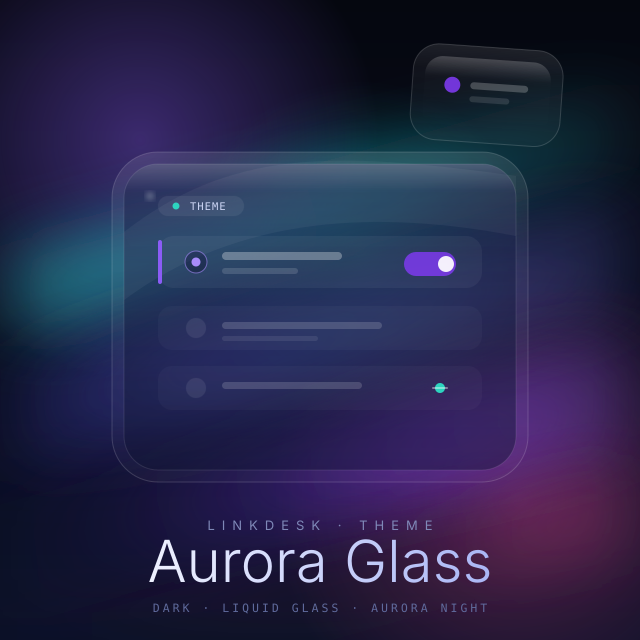

# 极光玻璃（theme-aurora-glass）



> LinkDesk 官方示例主题 · 深色 · 单色系「极光紫」
> **理念一句话：** 把 LinkDesk 的窗户开到一片极光夜空前。它不靠炫目的配色刷存在感——窗玻璃是半透明的（液态玻璃机制），背后一整幅极光夜从界面里透出来；你看到的每一个面板，都像悬浮在夜空里的一块磨砂玻璃，安静地接住光。

## 这是什么

一个**外观主题插件**（不是功能插件）：在 **外观 → 主题** 里选中「极光玻璃 Aurora Glass」，整个壳就换肤。它同时是壳「玻璃表面 + 全窗背景图」机制的**第一个真实消费者**——想自己动手做玻璃主题的人，拿它当参照最合适。

## 长什么样

- **底色**：深夜藏蓝，半透明（半透明面板是它和普通深色主题的分水岭——背景极光会从玻璃面板下渗上来）。
- **文字**：近白 `#F1F5FF` 主文字 + 柔蓝 `#A5B4E0` 次级，夜空里不刺眼。
- **accent 紫** `#7C3AED`：选中、按钮、开关、滚动条、拖放指示——全壳的「亮眼一笔」都归它。
- **联通青** `#2DD4BF`：连接成功的状态（串口通了、设备在线）。
- **极光背景图**：跟随面板起伏的夜空（`aurora-bg.svg`），几乎铺满全窗，但被压到很淡（参与度 0.3），保证前景内容始终清晰。

## 玻璃参数

壳主题引擎负责把「液态玻璃」真正画出来，主题这边只声明手感：

| 参数 | 值 | 含义 |
|---|---|---|
| `blur` | 24 | 玻璃背后内容模糊程度 |
| `saturate` | 1.25 | 透过玻璃的极光更饱和一点 |
| `tint` | `rgba(59,77,148,.35)` | 玻璃本身带一点藏蓝 |
| `opacity` | 0.275 | 玻璃不透明度（很透） |
| `specular` | 0.6 | 高光 / 反光强度（玻璃感） |
| `morph` · `radius` | 200ms · 12 | 表面切换动效时长 · 圆角 |
| `shadow` | 开 | 玻璃面板投下柔和投影 |

## 应用

1. **外观 → 主题** → 选 **极光玻璃 Aurora Glass**（深色）。
2. 想让它更衬你 → 换一个深色背景图，或调 accent 色，主题即点即生效。

## 色板（色系：极光紫）

| 角色 | 值 |
|---|---|
| accent / toggle / 滚动条 | `#7C3AED`（hover `#8B5CF6`） |
| 主文字 | `#F1F5FF` |
| 次级文字 | `#A5B4E0` · 弱文字 `#7E8CBB` |
| 激活图标 | `#A78BFA` · 未激活 `#6B77A8` |
| 联通成功 | `#2DD4BF` · 断开 `#64748B` |
| 危险 / 错误 | `#F87171` · 警告 `#FBBF24` |
| 面板底色 | `rgba(16–26, 51–48, 0.55)` 一族半透明藏蓝 |

## 资源

```
theme-aurora-glass/
├─ aurora-glass.json        # 主题本体（appearance.glass + 色系 colors）
├─ plugin.json              # 主题声明 + 图标
└─ resources/
   ├─ icon.svg              # 图标（靛→紫→粉渐变圆角方块 + 玻璃高光）
   ├─ aurora-bg.svg         # 1600×900 全窗极光夜空背景图
   └─ cover.svg             # 市场展示封面（极光 + 液态玻璃）
```

> 背景图 `aurora-bg.svg` 由主题自带给壳，走 `linkdesk://theme-aurora-glass/...`，主题自给自足、不依赖内置资产。
